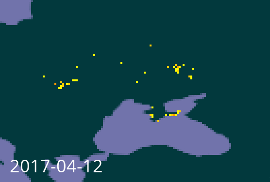

## Analytics maps

Bitmap maps in PNG format are generated for [global](https://analytics-files.gbif.org/global/map/) and [regional](https://analytics-files.gbif.org/gbifRegion/AFRICA/about/map/) occurrence data.  Three resolutions are produced: 0.1°, 0.2° and 0.4°.

Maps for countries are not provided, since it will usually be necessary to crop the map.  The source GeoTIFF data is provided, and the maps can be generated using the [occ_density.py](map/occ_density.py) script.

These steps will work on a computer with Docker installed:

```sh
# Download the occ_density.py script
curl -O https://raw.githubusercontent.com/gbif/analytics/master/R/map/occ_density.py

# Download the required GeoTIFF files
wget --recursive --no-parent https://analytics-files.gbif.org/country/UA/publishedBy/geotiff/
mv analytics-files.gbif.org/country/UA/publishedBy/geotiff .

# Produce whole-world maps in the three resolutions
docker run --rm -it --user $(id -u):$(id -g) -v $PWD:/analytics/ docker.gbif.org/analytics-figures python3 occ_density.py geotiff/*.tiff
# (Alternatively, install the required Python dependencies to avoid needing Docker.)

# Crop as required using ImageMagick
mkdir crop
cd map
for i in *two*.png; do convert $i -crop 139x94+990+165 -scale 400% +repage ../crop/$i; done

# Add labels
cd ../crop
for i in *two*.png; do
    date=$(echo $i | grep --only-matching ....-..-..)
    echo $date
    convert $i -pointsize 36 -fill white -draw "text 20,356 '$date'" l_$i
done

# Produce an animated GIF
convert -delay 50 l_occ_density_point_two_deg_*.png(P:-page:P:+0+0:) -loop 0 ua-growth.gif
```


